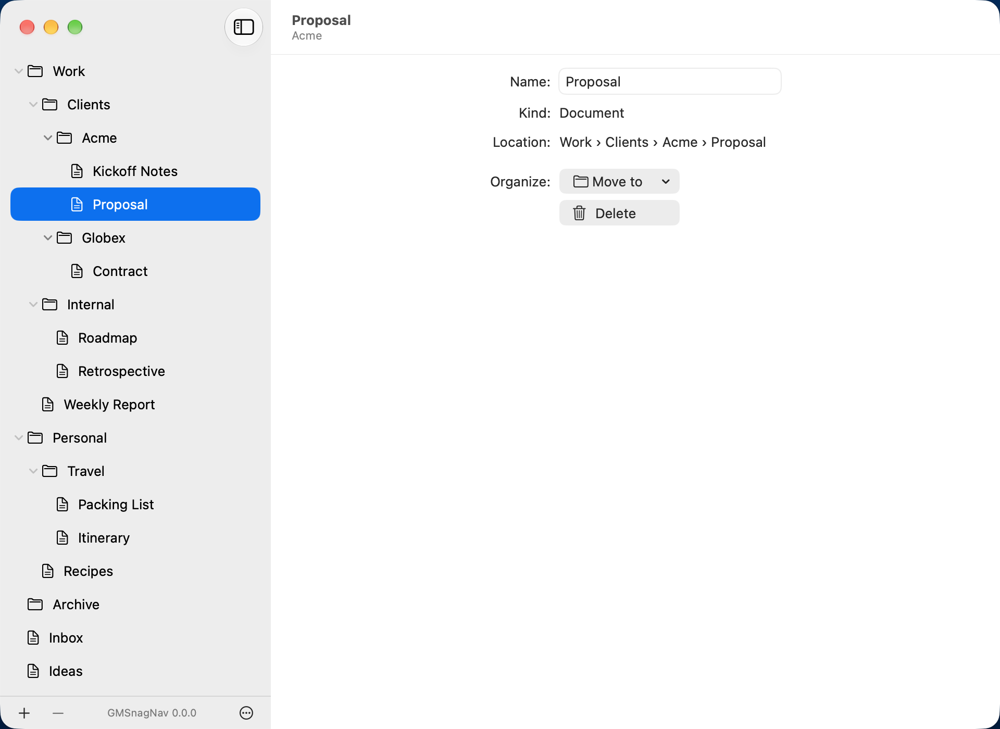
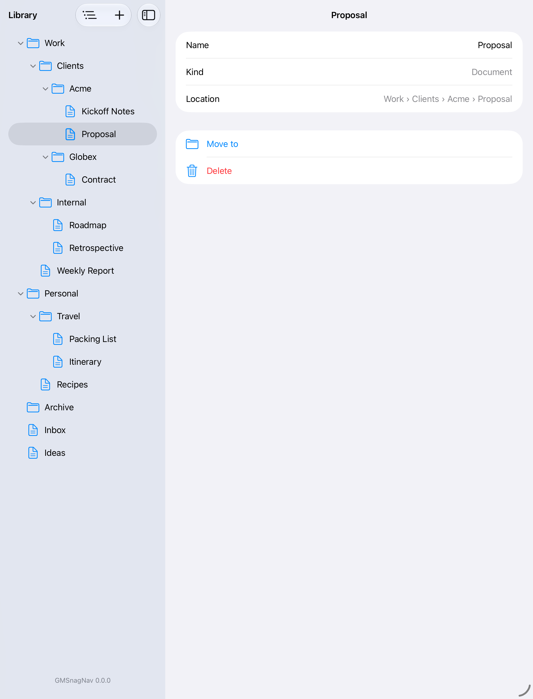

<p align="center">
  <picture>
    <source media="(prefers-color-scheme: dark)" srcset="docs/images/icon-dark.png">
    
  </picture>
</p>

<h1 align="center">GMSnagNav</h1>

<p align="center">
  A nested, drag-and-drop capable outline for SwiftUI — native on macOS, iOS and iPadOS.
</p>

> **What does SnagNav mean?** It stands for *snag navigation*: reliable, hands-on navigation through nested content, with selection, expansion, and drag and drop built in.

<p align="center">
  <a href="https://github.com/kerker00/GMSnagNav/actions/workflows/ci.yml?query=event%3Apull_request"></a>
  
  
  
  <a href="LICENSE"></a>
</p>

> **Status: pre-release.** The API is under active development and will change before `0.1.0`.
> It is not ready for production use yet.

<p align="center">
  <picture>
    <source media="(prefers-color-scheme: dark)" srcset="docs/images/macos-dark.png">
    
  </picture>
  <picture>
    <source media="(prefers-color-scheme: dark)" srcset="docs/images/ipad-dark.png">
    
  </picture>
</p>

## Why

SwiftUI's `List` can show a tree *or* reorder a flat list, but not both reliably: moving items
between levels of a hierarchy is where it breaks down, especially on macOS. GMSnagNav gives you
one SwiftUI API for arbitrarily deep trees with selection, expansion and real drag and drop:

- **macOS:** backed by a native `NSOutlineView` — system drop indicators, keyboard navigation,
  source-list styling and VoiceOver behave like in Finder or Mail.
- **iOS / iPadOS:** backed by a native `UICollectionView` list — the system's drag-and-drop
  interactions, drop indicators between rows and spring-loaded folders, like in the Files app.

## Design principles

- **You own your data.** Pass your own `Identifiable` values and a children key path, like
  `OutlineGroup`. The package keeps no second source of truth.
- **You decide what a drop means.** GMSnagNav reports *what* was dropped and *where*
  (onto an item, between rows, or the root). Your code validates and performs the move — whether
  your model is Core Data, SwiftData, the file system or plain values.
- **No dependencies.** Pure Swift, SwiftUI and the platform UI frameworks.
- **Explicit options, no magic.** Multi-selection, context menus, primary actions and
  drag-and-drop are opt-in modifiers.

## Features

- Arbitrarily deep trees with single, multiple or no selection and an optional expansion binding
- Drag and drop onto items, between rows and into the root, with host-side validation and
  redirection
- Spring-loaded expansion while dragging
- Context menus, primary action (double-click / Return / tap) and non-selectable rows
- Incremental, animated updates when your data changes
- Navigation of collapsed split views, such as on iPhone, from the selection
- Demo app for macOS and iOS

## Requirements

- macOS 26 or iOS / iPadOS 26
- Swift 6.2 or later (Xcode 26 or later)

## Installation

Add the package with Swift Package Manager:

```swift
dependencies: [
    .package(url: "https://github.com/kerker00/GMSnagNav.git", from: "0.1.0")
]
```

> No release has been tagged yet. Until then, depend on a specific commit.

## Usage

Show your own values with a children key path — `nil` marks a leaf, an array (possibly empty) a
container. Selection and expansion are sets of your identifiers:

```swift
import GMSnagNav
import SwiftUI

struct Item: Identifiable {
  let id: UUID
  var name: String
  var children: [Item]?
}

struct Sidebar: View {
  var library: Library
  @State private var selection: Set<Item.ID> = []
  @State private var expansion: Set<Item.ID> = []

  var body: some View {
    SnagOutline(
      library.roots, children: \.children, selection: $selection, expansion: $expansion
    ) { item in
      Label(item.name, systemImage: item.children == nil ? "doc" : "folder")
    }
    .outlineContextMenuItems { ids in
      ids.isEmpty
        ? []
        : [.action("Delete", systemImage: "trash", role: .destructive) { library.delete(ids) }]
    }
    .outlineDraggable()
    .onOutlineDrop { proposal in
      proposal.isDroppingIntoOwnSubtree ? .reject : .accept(.move)
    } perform: { proposal, _ in
      library.move(
        proposal.draggedIDs, into: proposal.target.parent,
        at: proposal.insertionIndexAfterRemoval)
    }
  }
}
```

`Library` stands for your own model; its `move` returns whether the move succeeded.

GMSnagNav never changes your data. When the user drops, `perform` receives the dragged
identifiers — only top-level ones, in display order — and the target: a parent (`nil` for the
root level) and, for drops between rows, the insertion index. `insertionIndexAfterRemoval` is
that index adjusted for removing the dragged items first, or `nil` for a drop onto an item, where
you typically append. After your model changes, the outline animates the rows to their new
place.

Identifiers must be unique across the whole tree. The demo app's
[`Library`](Examples/SnagNavDemo/SnagNavDemo/Model/Library.swift) shows a complete model with
validation and moves.

## Demo app

[`Examples/SnagNavDemo`](Examples/SnagNavDemo) is a multiplatform app for macOS and iOS that shows
how to add GMSnagNav with Swift Package Manager and how to use each feature. It grows with the
package.

The screenshots above come from the demo app. `Scripts/readme-screenshots.sh` takes them again on
macOS and an iPad simulator, in light and dark appearance.

## Documentation

The package's DocC catalog documents the whole API. Build it in Xcode with
**Product > Build Documentation**, or start with these articles:

- [Drag and Drop](Sources/GMSnagNav/GMSnagNav.docc/DragAndDrop.md) — reading proposals,
  validating, redirecting and performing drops.
- [Platform Differences](Sources/GMSnagNav/GMSnagNav.docc/PlatformDifferences.md) — where macOS
  and iOS behave differently, following the conventions of each platform.

## Roadmap

GMSnagNav is heading for its first release, `0.1.0`. Ideas for later versions, all planned to be
backward compatible:

- Drops from other apps, such as file URLs
- Copying with the Option key while dragging
- Inline renaming of rows
- Section headers
- Loading children asynchronously
- An empty-state view, custom drag previews and type-select

## Contributing

Bug reports, ideas and pull requests are welcome. See [CONTRIBUTING.md](CONTRIBUTING.md) for how to
build, test and format the code, and the [Code of Conduct](CODE_OF_CONDUCT.md).

## Acknowledgements

GMSnagNav is written from scratch. These projects shaped its design with their ideas and lessons
learned — thank you to their authors:

- [Sameesunkaria/OutlineView](https://github.com/Sameesunkaria/OutlineView) — `OutlineGroup`-style
  API and drop redirection.
- [ChimeHQ/Outline](https://github.com/ChimeHQ/Outline) — expansion and selection as sets of IDs,
  hosting SwiftUI rows in `NSOutlineView`.
- [dnadoba/Tree](https://github.com/dnadoba/Tree) — tree diffing with move inference.
- [umputun/agterm](https://github.com/umputun/agterm) — a production `NSOutlineView` sidebar with
  spring-loaded drags and UI-tested drag and drop.
- [shufflingB/swiftui-macos-tree-list-demo](https://github.com/shufflingB/swiftui-macos-tree-list-demo)
  — a careful study of the limits of pure-SwiftUI tree lists.
- [revblaze/SimpleSidebar](https://github.com/revblaze/SimpleSidebar) — minimal native sidebar setup.

## License

GMSnagNav is available under the MIT license. See [LICENSE](LICENSE) for details.
